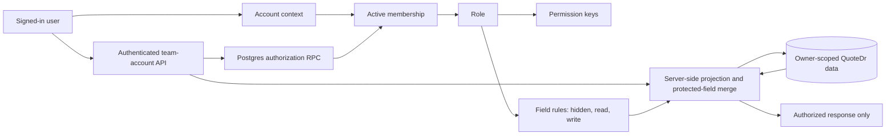

# QuoteDr team accounts and permission architecture

## Recommendation

Use a company account as the authorization boundary, while keeping each person as an independent Supabase Auth user. Memberships point to roles, roles point to stable permission keys, and roles also carry field-level `read` or `write` mappings. Application code asks for capabilities such as `quotes.update` or `payments.manage`; it does not branch on role names.

Capabilities and fields remain separate on purpose. A capability answers whether an action is allowed. A field rule answers whether a value may be sent and whether a submitted change may be accepted. Effective access requires both. A missing field mapping means hidden, so adding a new sensitive field cannot silently grant it to existing custom roles.

Existing QuoteDr records continue to use the account owner's `user_id` as their tenant key. This preserves legacy owners and avoids a high-risk rewrite of every table in one release. `accounts.owner_user_id` maps an account to that tenant key. New actor columns record which human created or last changed shared data.

Sensitive base tables remain owner-only under RLS. Team members use one authenticated `team-account` Edge Function. For every request, that function asks Postgres to authorize the caller's live membership and permission, reads the owner's data with the service role, and returns only an allowed projection. Browser permission checks improve the interface but never authorize access.

## Security boundaries

1. Supabase Auth establishes the user identity. Shared passwords are not used.
2. Postgres establishes account membership, current status, role, and permission for every protected API action.
3. RLS keeps `quotes`, `items`, `user_data`, Stripe records, payment records, and other legacy owner tables inaccessible to team-member JWTs.
4. The service role exists only inside Edge Functions. It is never sent to a browser.
5. Server redaction removes costs, supplier links, markup, margin, profit, payment state, Stripe settings, billing data, integration secrets, and secure-share credentials before serialization.
6. Restricted quote updates merge against the current server record. Hidden values are preserved server-side and cannot be overwritten by adding forbidden JSON keys to a request.
7. Invitation tokens are random, SHA-256 hashed at rest, email-bound, expiring, single-use, and accepted atomically.
8. Restrictive owner-boundary policies on quotes, items, clients, templates, user settings, Stripe connections, and payment records remain an additional RLS condition even if a permissive policy is added later.
9. Browser caches are keyed to the signed-in user, account, and complete permission set. User, account, or role changes clear tenant local/session storage and the durable-save database before shared data is loaded.
10. Account, role, permission, membership, invitation, and audit tables have no authenticated Data API grants. Browser users receive only purpose-built RPC or Edge Function responses.
11. Field access defaults to hidden. Read responses are projected before serialization, and hidden or read-only values are restored from the current server row during writes.
12. System roles are immutable. Custom roles are account-scoped, saved atomically, and may be archived only after members are reassigned and pending invitations are revoked.
13. Capability dependencies and field-to-capability requirements are database data, not role-name branches in application code.

## Initial permissions matrix

The role columns below are seed data. A future role can be added by inserting a role and permission mappings without adding authorization branches to the application.

| Capability | Permission | Owner | Estimator |
|---|---|:---:|:---:|
| View account context | `account.read` | Yes | Yes |
| View team and invitations | `team.read` | Yes | No |
| Invite, suspend, remove, or reassign members | `team.manage` | Yes | No |
| Define roles and mappings | `roles.manage` | Yes | No |
| View customer-facing business profile | `business.read` | Yes | Yes |
| Change business profile or company settings | `business.manage`, `settings.manage` | Yes | No |
| View quotes | `quotes.read` | Yes | Yes, redacted |
| Create and edit quotes | `quotes.create`, `quotes.update`, `quotes.fields.write` | Yes | Yes |
| Delete or send quotes | `quotes.delete`, `quotes.send` | Yes | No |
| View or manage costs, markup, margin, and profit | `quotes.pricing.read`, `quotes.pricing.manage` | Yes | No |
| Use saved items | `items.read` | Yes | Yes, redacted |
| Manage saved items or view item costs | `items.manage`, `items.pricing.read` | Yes | No |
| View, create, and update clients | `clients.read`, `clients.manage` | Yes | Yes |
| Delete clients | `clients.delete` | Yes | No |
| Use account templates | `templates.read` | Yes | Yes, redacted |
| Manage templates | `templates.manage` | Yes | No |
| View or manage customer payments | `payments.read`, `payments.manage` | Yes | No |
| View or manage the QuoteDr subscription | `billing.read`, `billing.manage` | Yes | No |
| Manage QuickBooks and future integrations | `integrations.manage` | Yes | No |
| View or manage internal labor records | `labor.read`, `labor.manage` | Yes | No |
| View account analytics | `analytics.read` | Yes | No |

The owner is a protected account invariant, not merely a label: the owner membership cannot be reassigned, suspended, or deleted through team-management APIs. Assignable roles are identified by the `is_assignable` column, not by a list of role names in the client.

## Field permissions matrix

`Hidden` means the API omits the value. `View` means the API returns it but restores the stored value if a write request tries to change it. `Edit` permits a change only when the request also passes the operation capability. Internal costs, markup, margin, profit, payments, billing, and integrations remain capability-protected and are not made visible by customer-pricing field access.

| Field group | Stable field keys | Owner | Estimator default | Custom role choices |
|---|---|:---:|:---:|---|
| Quote identity | `quotes.number`, `quotes.title`, `quotes.dates` | Edit | Edit | Hidden / View / Edit |
| Quote client contact | `quotes.client_name`, `quotes.client_phone`, `quotes.client_email`, `quotes.project_address` | Edit | Edit | Hidden / View / Edit |
| Quote scope | `quotes.scope`, `quotes.notes`, `quotes.terms` | Edit | Edit | Hidden / View / Edit |
| Customer sell pricing | `quotes.customer_pricing` | Edit | Edit | Hidden / View / Edit |
| Saved client contact | `clients.name`, `clients.phone`, `clients.email`, `clients.address` | Edit | Edit | Hidden / View / Edit |
| Saved client private details | `clients.notes`, `clients.crm` | Edit | Edit | Hidden / View / Edit |
| Customer-facing company profile | `business.*` | View in team API | View | Hidden / View |
| Saved item catalog | `items.name`, `items.description`, `items.sell_price`, `items.photos` | View in team API | View | Hidden / View |

The business profile and saved-item catalog are currently read-only through the shared-account API, so the editor does not offer an `Edit` choice for those fields. That prevents the UI from promising a write path the backend does not yet support. Owners retain their existing direct management behavior.

## Required schema changes

| Object | Purpose |
|---|---|
| `accounts` | Company boundary and legacy owner tenant mapping. |
| `account_permissions` | Stable capability catalog and sensitivity metadata. |
| `account_roles` | Global system roles or future account-specific roles. |
| `account_role_permissions` | Many-to-many role capability assignments. |
| `account_permission_dependencies` | Data-driven capability prerequisites used by the role editor and database validation. |
| `account_fields` | Stable field catalog, sensitivity metadata, and required read/write capabilities. |
| `account_role_fields` | Per-role `read`/`write` mappings; absence means hidden. |
| `account_memberships` | User-to-account membership, role, and active/suspended state. |
| `account_invitations` | Hashed invitation token, normalized email, role, expiry, acceptance, and revocation. |
| `account_audit_events` | Append-only security-relevant team events without secret payloads. |
| `quotedr_authorize_account` | Database authorization gate used by authenticated APIs. |
| `quotedr_account_context` | Safe account, role, and permission context for the signed-in user. |
| `quotedr_accept_team_invitation` | Atomic, verified-email invitation acceptance. |
| `quotedr_save_account_role` | Atomic account-scoped custom-role and mapping create/update with a live `roles.manage` check. |
| `quotedr_archive_account_role` | Safe custom-role archival after assignment and invitation checks. |
| Actor columns | `created_by_user_id` and `updated_by_user_id` on quotes, items, clients, and templates. |

The migration backfills one account and owner membership for every existing Auth user. A new-user trigger provisions future account owners. Users created by the team invitation flow skip owner provisioning only when their metadata hint matches a live server-side invitation for the same email; the user-editable hint alone never changes access or provisioning.

All new tables use explicit grants and RLS, and none has an authenticated table grant. Permission helpers live in a private schema. Public RPC execution is granted only to authenticated users, and each RPC derives the user from `auth.uid()` rather than accepting a user ID.

The migration also adds restrictive owner-only policies for both anonymous and authenticated Data API roles on the existing quotes, items, clients, templates, user settings, Stripe connection, and payment record tables. Owners keep their direct legacy access, while an anonymous or team-member JWT cannot select a raw row even if another permissive policy is introduced later.

## API authorization map

| API action | Required permission |
|---|---|
| `context` | Authenticated user; returns only their memberships |
| `roles.list`, `team.list` | `team.read` |
| `roles.catalog`, role create/update/archive | `roles.manage`; Postgres re-checks it inside each role mutation |
| `team.invite`, invitation revoke, member update/remove | `team.manage` |
| `invitation.accept` | Authenticated, confirmed email matching the invitation |
| `business.get`, `business.logo` | `business.read` |
| `payments.get` | `payments.read` |
| `entitlements.get` | `account.read`; returns feature flags only and filters them by permissions |
| `quotes.list`, `quotes.get` | `quotes.read` |
| Quote insert/update/delete | `quotes.create`, `quotes.update`, `quotes.delete` respectively |
| `items.list` | `items.read`; cost fields additionally require `items.pricing.read` |
| `clients.list`, client save/replace | `clients.read`, `clients.manage`; replacement deletes additionally require `clients.delete` |
| `templates.list` | `templates.read` |
| Stripe Connect | `payments.read` for status, `payments.manage` for changes |
| Subscription checkout | `billing.manage` |
| QuickBooks OAuth and sync | `integrations.manage` |
| Send email and create secure client share link | `quotes.send` |

## Redacted quote behavior

Quote data is JSON, so row-level policies cannot safely reveal the row while hiding individual nested fields. Estimators and custom roles therefore never select the base quote row with their JWT.

To keep the quote builder intuitive, server responses flatten hidden room and line markup into customer-facing rates and totals. An estimator sees the same customer price without learning the markup percentage. The server adds opaque HMAC references to returned rooms and items. On save it verifies those references against the current record, reverses the display-price transform, and restores protected fields from the original row. New lines in an existing room inherit only the hidden room price factor; injected cost or markup keys are discarded.

This produces these invariants:

- Repeated load/save cycles do not compound markup.
- A legitimate customer-price edit is preserved.
- Material cost, supplier URL, markup, margin, profit, Stripe state, payment history, billing, integrations, portal PINs, and share tokens never appear in a restricted response.
- Restricted requests cannot clear or overwrite hidden fields.
- A missing field mapping removes that field from the response, including legacy top-level quote aliases and nested JSON aliases.
- A read-only field is restored from the current database row even if a caller forges a different value in the request.
- A stale quote version is rejected instead of silently merging over newer work.
- A user without `quotes.send` cannot modify a sent, shared, accepted, invoiced, paid, or otherwise finalized document.

## User experience

- Owners get a Team tab in Settings with role selection, invitation status, member suspension, reassignment, and removal.
- Owners can duplicate system templates, build account-specific roles, and choose Hidden, View, or Edit for each supported field.
- “Customize access” on a member creates and assigns a one-person role, so an owner can adjust one estimator without changing every estimator.
- Capability prerequisites are selected automatically in the editor and validated again atomically in Postgres.
- Invited people use `team-invite.html`, sign in with the invited email, and create a password when the invitation created their Auth user.
- The browser stores the active account ID and routes shared-account data through the team API.
- Team feature gates receive only allowed feature names; the owner's subscription status, billing identifiers, and invoice details are not copied to the member browser.
- Switching users, accounts, or permission sets clears account-scoped browser caches while preserving the Supabase session and remembered sign-in email.
- Controls for capabilities the user lacks are hidden, including markup, material cost, profit, send, payment, integration, and billing controls.
- An estimator who opens Settings sees a short owner-only explanation instead of empty or misleading payment and billing forms.
- Client-side hiding is only presentation. Direct requests still fail at the database/API authorization gate.

## Test plan

### Database integration

1. Backfill an existing user and assert exactly one account and active owner membership.
2. Create an invited Auth user and assert the provisioning hint does not create an owner account.
3. Assert estimator JWTs receive no rows from direct selects against quotes, items, `user_data`, Stripe, payment, invitation, and audit tables.
4. Assert owners retain existing CRUD behavior on legacy owner-scoped tables.
5. Assert `quotedr_authorize_account` succeeds only for an active membership with the requested mapped permission.
6. Suspend and remove a membership, then assert authorization stops immediately without waiting for a JWT refresh.
7. Assert account-specific roles cannot be assigned across accounts.
8. Assert the owner membership cannot be reassigned, suspended, removed, or assigned to another user.
9. Assert invitation acceptance rejects a wrong email, unconfirmed email, expired token, revoked token, reused token, and malformed token.
10. Race two acceptance transactions and assert only one succeeds.
11. Create and update a custom role and assert its capability and field mappings change atomically.
12. Assert custom-role mutation rejects another account, a system role, a missing capability prerequisite, an unknown field, and `write` on a read-only field.
13. Assert role archival rejects assigned roles and roles used by live invitations.
14. Assert the context RPC returns only the caller's field map and omits unmapped fields.

### API and data-policy tests

1. Call every action without a JWT, without an account ID, with another account ID, with a suspended membership, and without its capability; expect a deny response and no mutation.
2. Verify list/get responses contain no forbidden key at any nesting level.
3. Verify material cost and supplier URLs are absent from saved-item and template responses.
4. Verify a quote with room and item markup returns the same customer price to an estimator.
5. Load/save/load without edits and assert no price compounding.
6. Change a visible rate and assert the customer price changes while original hidden costs and markup remain intact.
7. Attempt to inject cost, markup, payment settings, Stripe identifiers, portal PINs, and share tokens; assert the server discards or preserves the original protected values.
8. Reorder lines using valid opaque references and assert hidden values stay with the correct line.
9. Forge or remove a reference and assert it cannot expose or overwrite another line's protected data.
10. Assert stale version updates return a conflict.
11. Assert Stripe, checkout, QuickBooks, email, and secure-link functions deny the estimator role before any external side effect.
12. Hide quote email, phone, address, notes, scope, and customer pricing one at a time; assert each value and every documented alias is absent from the serialized response.
13. Mark fields read-only, forge updates, and assert the stored values are preserved while independently writable fields change.
14. Repeat field projection and write-preservation tests for clients, the business profile, saved items, and templates.
15. Assert a field mapping cannot compensate for a missing action capability, and a capability cannot compensate for a hidden field mapping.

### Browser and regression

1. Owner: sign in, open every existing screen, create/edit/delete/send a quote, manage saved items, connect settings, and confirm legacy behavior.
2. Owner: invite an estimator, copy the fallback link, revoke and resend invitations, suspend/reactivate, change role, and remove.
3. Invitee: accept with the invited email, create a password, sign out/in independently, and land in the shared account.
4. Estimator: create and edit quotes, use saved items/templates, and manage clients.
5. Estimator: confirm material costs, supplier URLs, markup, profit reports, Stripe, billing, QuickBooks, labor, and team controls are absent.
6. Estimator: use browser developer tools to call direct Supabase tables and protected functions; confirm server denial and no sensitive response body.
7. Confirm owner and estimator edits attribute the correct actor.
8. Sign out an owner and sign in an estimator in the same browser profile; confirm old drafts, invoices, payment settings, costs, and durable-save recovery payloads are not visible.
9. Switch between two authorized accounts and confirm account-scoped caches are reset before the next account loads.
10. Confirm mobile layouts, keyboard operation, focus order, status messages, and screen-reader labels on Team and invitation screens.
11. Duplicate the estimator template, change several capabilities and fields, save, edit, archive, and verify system templates never change.
12. Use “Customize access” for one estimator and confirm only that member receives the new role.
13. Confirm hidden quote controls disappear, read-only controls disable, and direct forged requests still preserve protected values.
14. Run the existing durable-save, quote-builder, dashboard, client, payment, and portal regression suites.

## Rollout plan

1. Apply `20260807022336_team_accounts_rbac.sql`, then `20260807110226_custom_role_field_permissions.sql`, then `20260808000920_team_rbac_foreign_key_indexes.sql`. Verify backfill counts, policies, grants, role RPCs, default field mappings, and foreign-key index coverage in a staging project.
2. Deploy `team-account` and the updated protected Edge Functions together. Configure `TEAM_DATA_REFERENCE_SECRET` or deliberately use the existing service-role secret fallback.
3. Add the production and local `team-invite.html` URLs to the Supabase Auth redirect allowlist.
4. Publish the static client files after the database and functions are available. Legacy owner fallback preserves current local behavior during the transition, but invitations should remain hidden until the backend is live.
5. Run the database/API adversarial suite with two real test users before enabling invitations for customers.
6. Monitor authorization denials, invitation failures, stale-write conflicts, and redaction failures without logging tokens or quote payloads.
7. Keep rollback additive: hide the Team entry and stop invitation creation while leaving account and membership rows intact. Do not remove actor columns or owner backfill during rollback.

No deployment is implied by this design document. Migration and Edge Function source in this branch must be reviewed and released as one coordinated security change.
